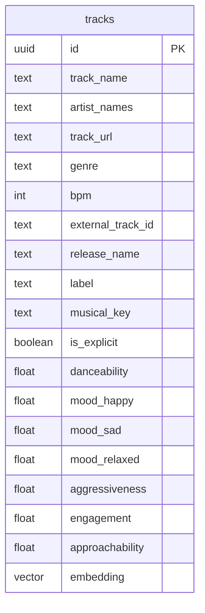
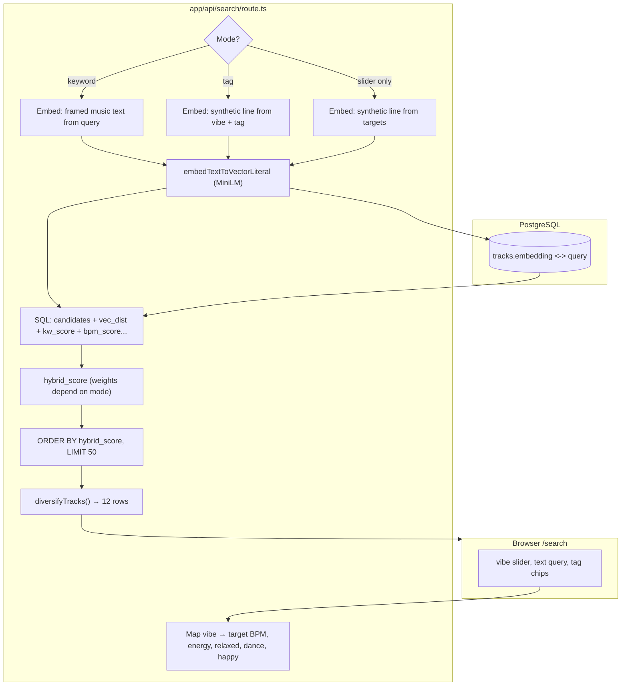
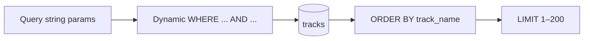

# AI Playlist

Next.js app for track ingest, **pgvector** similarity search, and playlist flows. Postgres holds catalog rows with audio-derived features and a **384-dimensional** embedding (same space as `Xenova/all-MiniLM-L6-v2`).

## Getting started

Set `DATABASE_URL` (see `lib/db.ts` for default). Apply `schema.sql`, then `migrations/` if your DB predates those columns.

```bash
bun install
bun dev
```

App runs on **port 3022** by default (`package.json`).

---

## Database

**Local Docker + pgvector** and **server requirements**: [docs/POSTGRES_AND_PGVECTOR.md](docs/POSTGRES_AND_PGVECTOR.md) (`npm run db:docker:up`, `npm run db:studio`).

PostgreSQL with the **`vector`** extension. All catalog data lives in **`tracks`**. Similarity uses **cosine-style** distance (`embedding <-> query`) with an **HNSW** index for fast approximate nearest-neighbor search.

### Entity relationship (Mermaid)



`artist_names` is `TEXT[]` in Postgres; Mermaid shows it as a single logical field. `embedding` is `vector(384)` with an HNSW index (`vector_cosine_ops`).

### Table layout (ASCII)

```
┌─────────────────────────────────────────────────────────────────────────────┐
│ tracks                                                                       │
├─────────────────────────────────────────────────────────────────────────────┤
│ id (uuid, PK)                                                                │
│ track_name, artist_names[], track_url, genre, bpm                             │
│ external_track_id (unique when set), release_name, label, musical_key       │
│ is_explicit                                                                  │
│ danceability, mood_*, aggressiveness, engagement, approachability (0–1)      │
│ embedding vector(384)  ←── MiniLM-aligned; HNSW (vector_cosine_ops)         │
└─────────────────────────────────────────────────────────────────────────────┘
       ▲                          ▲
       │                          │
   ingest / CSV              query embedding
   builds text +              from UI or LLM
   audio features             narrative
```

Indexes (from `schema.sql`): `genre`, `label`, `musical_key`, `bpm`, partial unique on `external_track_id`, **HNSW on `embedding`**.

---

## Search vs filter (two different APIs)

| Path | Method | Role |
|------|--------|------|
| `/api/search` | `POST` | **Hybrid** semantic + metadata signals (vibe slider, optional keyword, optional mood tag). Uses embeddings + SQL scoring + artist diversification. |
| `/api/tracks/browse` | `GET` | **Filter only** — `ILIKE` on name/artist/genre/label/key/external id, BPM range, `media` (`all` / `youtube` / `audio`). **No vectors.** |

### End-to-end: hybrid search (`POST /api/search`)



**Modes (server):**

1. **Keyword** — `searchQuery` set: `ILIKE` pattern on title (strongest), artists, genre, combined with vector distance; BPM band filter is **off** so recall stays high.
2. **Tag** — e.g. `dance` / `happy` / `relaxed`: SQL **requires** the matching mood/feature column above a threshold, then ranks by semantics + energy + BPM.
3. **Slider-only** — no keyword/tag: synthetic embed from vibe; candidates constrained to **BPM ± 45** around target BPM; score blends vector distance, energy, relaxed, BPM.

After SQL, **`lib/server/diversify.ts`** re-orders the top pool so the same artist does not dominate consecutive slots.

### End-to-end: browse filter (`GET /api/tracks/browse`)



Query parameters: `name`, `artist`, `genre`, `label`, `key`, `externalId`, `bpmMin`, `bpmMax`, `media`, `limit`. All conditions are optional; unset params are ignored (`NULL` in SQL).

---

## Learn More

- [Next.js Documentation](https://nextjs.org/docs)
- [pgvector](https://github.com/pgvector/pgvector)
